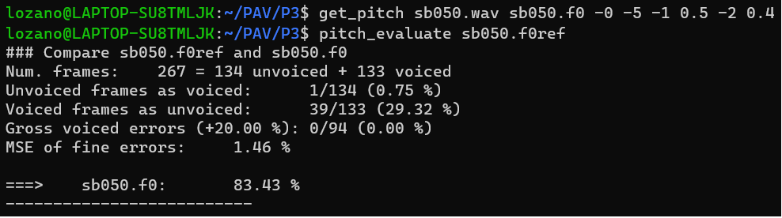

PAV - P3: detección de pitch
============================

Esta práctica se distribuye a través del repositorio GitHub [Práctica 3](https://github.com/albino-pav/P3).
Siga las instrucciones de la [Práctica 2](https://github.com/albino-pav/P2) para realizar un `fork` de la
misma y distribuir copias locales (*clones*) del mismo a los distintos integrantes del grupo de prácticas.

Recuerde realizar el *pull request* al repositorio original una vez completada la práctica.

Ejercicios básicos
------------------

- Complete el código de los ficheros necesarios para realizar la detección de pitch usando el programa
  `get_pitch`.

   * Complete el cálculo de la autocorrelación e inserte a continuación el código correspondiente.

	> A continuación se presenta el código de la autocorrelación:

	> ```cpp
 	> void PitchAnalyzer::autocorrelation(const vector<float> &x, vector<float> &r) const {
	>
    	> 	for (unsigned int l = 0; l < r.size(); ++l) {
  	>		/// \TODO Compute the autocorrelation r[l]
      	> 		/// \DONE Autocorrelation r[l] computed
      	> 		r[l] = 0;
      	>		for (unsigned int n = l; n < x.size(); n++){
        >			r[l] += x[n-l]*x[n];
      	>		}
    	> 	}
	>
    	> 	if (r[0] == 0.0F) //to avoid log() and divide zero 
      	> 		r[0] = 1e-10; 
  	> 	}
	> ```

   * Inserte una gŕafica donde, en un *subplot*, se vea con claridad la señal temporal de un segmento de
     unos 30 ms de un fonema sonoro y su periodo de pitch; y, en otro *subplot*, se vea con claridad la
	 autocorrelación de la señal y la posición del primer máximo secundario.

	 NOTA: es más que probable que tenga que usar Python, Octave/MATLAB u otro programa semejante para
	 hacerlo. Se valorará la utilización de la librería matplotlib de Python.

	> Hemos trabajado con el audio *rl002.wav* de la base de entrenamiento, ya que tiene suficientes tramos
	> sonoros y sordos para la correcta evaluación del sistema.
	>
	> Para nuestro código en Python, primero importamos las librerías necesarias: *matplotlib* y *soundfile*.
	> El código es el siguiente:
	>
	> ```py
	> # Imports
	> import numpy as np
	> import matplotlib.pyplot as plt
	> import matplotlib.gridspec as gridspec
	> import soundfile as sf
	>
	> signal, fm = sf.read('rl002.wav') # Usamos señal rl002
	> t = np.arange(0, len(signal)) / fm 
	>
	> t_ms = 30                 # 30 ms
	> l = int((fm * t_ms)/1e3)  # 'l' muestras
	>
	> def autocorrelacion(vector):
    	>	autocorrelation = np.correlate(vector, vector, mode = 'full')
    	>	return autocorrelation[autocorrelation.size//2:]
	>
	> # Create 2x2 sub plots
	> gs = gridspec.GridSpec(2, 2)
	>
	> plt.figure()
	> ax = plt.subplot(gs[0, 0]) # row 0, col 0
	> plt.plot(t, signal)
	> plt.title('Señal completa (rl002)', fontweight = 'bold')
	> plt.xlabel('s', fontsize = 10)
	> plt.ylabel('Amplitud', fontsize = 10)
	>
	> ax = plt.subplot(gs[0, 1]) # row 0, col 1
	> plt.plot(t[fm:fm+l], signal[fm:fm+l])
	> plt.title('Señal recortada (30ms)', fontweight = 'bold')
	> plt.xlabel('Muestras', fontsize = 10)
	> plt.ylabel('Amplitud', fontsize = 10)
	>
	> ax = plt.subplot(gs[1, :]) # row 1, span all columns
	> plt.plot(t[:l]*1000, autocorrelacion(signal[fm:fm+l]))
	> plt.title('Autocorrelación', fontweight = 'bold')
	> plt.xlabel('n', fontsize = 10)
	> plt.ylabel('Amplitud', fontsize = 10)
	>
	> plt.tight_layout()
	> plt.show()
	> ```
	>
	> **Nota:** este código, junto al resto de códigos de Python empleados para realizar las distintas 
	> gráficas pedidas en esta práctica, se pueden encontrar en el repositorio **graphs** dentro de **P3**.
	>
	> 

   * Determine el mejor candidato para el periodo de pitch localizando el primer máximo secundario de la
     autocorrelación. Inserte a continuación el código correspondiente.

	> Para encontrar la diferencia (lag), debemos hacer la resta entre el origen y el primer máximo secundario 
	> de la autocorrelación. Si trabajamos con una trama sorda, no podremos obtener el pitch, por lo que devolvemos
	> un 0. Sin embargo, cuando trabajamos con una trama sonora, devolveremos su pitch. El código es el siguiente:
	>
	>```cpp
	>  float PitchAnalyzer::compute_pitch(vector<float> & x) const {
    	> 	if (x.size() != frameLen)
      	>		return -1.0F;
	>
    	> 	//Window input frame
    	> 	for (unsigned int i=0; i<x.size(); ++i)
      	> 		x[i] *= window[i];
	>
    	> 	vector<float> r(npitch_max);
	>
  	> 	//Compute correlation
    	> 	autocorrelation(x, r);
	>
    	> 	vector<float>::const_iterator iR = r.begin(), iRMax = r.begin() + npitch_min;
	>
    	> 	/// \TODO 
	> 	/// Find the lag of the maximum value of the autocorrelation away from the origin.<br>
	> 	/// Choices to set the minimum value of the lag are:
	> 	///    - The first negative value of the autocorrelation.
	> 	///    - The lag corresponding to the maximum value of the pitch.
    	> 	///	   .
	> 	/// In either case, the lag should not exceed that of the minimum value of the pitch.
  	> 	/// \DONE
    	> 	for(iR = r.begin() + npitch_min; iR < r.begin() + npitch_max; iR++){
      	> 		if(*iR > *iRMax){
        > 			iRMax = iR;
      	> 		}
    	> 	}
	>
    	> 	unsigned int lag = iRMax - r.begin();
	>
    	> 	float pot = 10 * log10(r[0]);
	>
    	> 	//You can print these (and other) features, look at them using wavesurfer
    	> 	//Based on that, implement a rule for unvoiced
    	> 	//change to #if 1 and compile
	> #if 1
    	> 	if (r[0] > 0.0F)
      	>		cout << pot << '\t' << r[1]/r[0] << '\t' << r[lag]/r[0] << endl;
	> #endif
   	> 
    	> 	if (unvoiced(pot, r[1]/r[0], r[lag]/r[0]))
      	>		return 0;
    	> 	else
      	> 		return (float) samplingFreq/(float) lag;
  	>  }
	> ```

   * Implemente la regla de decisión sonoro o sordo e inserte el código correspondiente.

	> ```cpp
	> bool PitchAnalyzer::unvoiced(float pot, float r1norm, float rmaxnorm) const {
    	>	/// \TODO Implement a rule to decide whether the sound is voiced or not.
    	>	/// * You can use the standard features (pot, r1norm, rmaxnorm),
    	>	///   or compute and use other ones.
    	>	/// \DONE
    	>	if (pot < -23 || r1norm < 0.5 || rmaxnorm < 0.4)
      	>		return true;
    	>	else
      	>		return true;
  	> }
	> ```
	>
	> Con estos parámetros, **que ya han sido *ligeramente* optimizados**, obtenemos un resultado total del 90.51%:
	>
	> 
	>
	> **Nota:** en el siguiente apartado se discutirán las caracterísitcas que nos interesan de estos tres parámetros.

- Una vez completados los puntos anteriores, dispondrá de una primera versión del detector de pitch. El 
  resto del trabajo consiste, básicamente, en obtener las mejores prestaciones posibles con él.

  * Utilice el programa `wavesurfer` para analizar las condiciones apropiadas para determinar si un
    segmento es sonoro o sordo. 
	
	  - Inserte una gráfica con la detección de pitch incorporada a `wavesurfer` y, junto a ella, los 
	    principales candidatos para determinar la sonoridad de la voz: el nivel de potencia de la señal
		(r[0]), la autocorrelación normalizada de uno (r1norm = r[1] / r[0]) y el valor de la
		autocorrelación en su máximo secundario (rmaxnorm = r[lag] / r[0]).

		Puede considerar, también, la conveniencia de usar la tasa de cruces por cero.

	    Recuerde configurar los paneles de datos para que el desplazamiento de ventana sea el adecuado, que
		en esta práctica es de 15 ms.

	> Las gráficas obtenidas con el audio **rl002.wav** son las siguientes:
	>
	> 
	>
	> En estas gráficas se muestra la **potencia** en dB, la *autocorrelación normalizada en 1* y la 
	> **autocorrelación normalizada en el primer máximo secundario**, que son los parámetros que usamos para
	> implementar la regla de decisión (*visto en el apartado anterior*). 
	>
	> Con *WaveSurfer* hemos podido observar que la potencia es útil para saber cuándo está hablando la persona 
	> de nuestro audio (*rl002.wav*). Sin embargo, vemos que no es un buen parámetro para detectar exactamente dónde
	> se encuentran los tramos sonoros. Por otro lado, vemos como las gráficas de las autocorrelaciones sí marcan 
	> mejor los tramos sonoros. Observamos como **r1norm** marca los tramos sonoros de forma más *suave*, mientras
	> que **rmaxnorm** los marca de forma más *abrupta*. Esto tiene sus *pros* y sus *contras*. 
	>
	> Por tanto, llegamos a la conclusión de que el resultado óptimo se obtendrá a partir de la combinación de estos
	> tres parámetros.

      - Use el detector de pitch implementado en el programa `wavesurfer` en una señal de prueba y compare
	    su resultado con el obtenido por la mejor versión de su propio sistema.  Inserte una gráfica
		ilustrativa del resultado de ambos detectores.
  
  * Optimice los parámetros de su sistema de detección de pitch e inserte una tabla con las tasas de error
    y el *score* TOTAL proporcionados por `pitch_evaluate` en la evaluación de la base de datos 
	`pitch_db/train`..

	> Después de observar las gráficas obtenidas, hemos establecido unos parámetros iniciales, estos eran:
	>
	> * **pot** = -20
	> * **r1norm** = 0.5
	> * **rmaxnorm** = 0.4
	>
	> Los valores de las autocorrelaciones estaban bastante bien definidos, ya que un pequeño cambio en estos
	> parámetros provocaba una gran bajada en el *Score* total. Por tanto, a partir de un proceso de *prueba y error*
	> hemos ido variando el valor de la potencia hasta obtener un resultado óptimo. Los valores de los parámetros son:
	>
	> * **pot** = -18
	> * **r1norm** = 0.5
	> * **rmaxnorm** = 0.4
	>
	> Las tasas de error obtenidas son las siguientes:
	>
	> 
	

   * Inserte una gráfica en la que se vea con claridad el resultado de su detector de pitch junto al del
     detector de Wavesurfer. Aunque puede usarse Wavesurfer para obtener la representación, se valorará
	 el uso de alternativas de mayor calidad (particularmente Python).

	> En *WaveSurfer*:
	>
	> 
	>
	> En *Python*:
	>
	> 	
	>
	> El código empleado para estas gráficas se muestra a continuación:
	>
	>```py
	> # Imports 
	> import numpy as np
	> import matplotlib.pyplot as plt
	> import matplotlib.gridspec as gridspec
	> 
	> pitch_programa = np.loadtxt('pitch_programa.f0')
	> pitch_wave = np.loadtxt('pitch_wave.f0')
	>
	> # Create 2x2 sub plots
	> gs = gridspec.GridSpec(2, 2)
	>
	> plt.figure()
	> ax = plt.subplot(gs[0, 0]) # row 0, col 0
	> plt.plot(pitch_programa, '8', c='blue', markersize = 1)
	> plt.title('Pitch Programa', fontweight = 'bold')
	> plt.xlabel('s', fontsize = 10)
	> plt.ylabel('Hz', fontsize = 10)
	>
	> ax = plt.subplot(gs[0, 1]) # row 0, col 1
	> plt.plot(pitch_wave, 'D', c='red', markersize = 1)
	> plt.title('Pitch WaveSurfer', fontweight = 'bold')
	> plt.xlabel('s', fontsize = 10)
	> plt.ylabel('Hz', fontsize = 10)
	>
	> ax = plt.subplot(gs[1, :]) # row 1, span all columns
	> plt.plot(pitch_programa, '8', c='blue', markersize = 1)
	> plt.plot(pitch_wave, 'D', c='red', markersize = 1)
	> plt.title('Programa vs Wave', fontweight = 'bold')
	> plt.xlabel('s', fontsize = 10)
	> plt.ylabel('Hz', fontsize = 10)
	>
	> plt.tight_layout()
	> plt.show()
	> ```
	>
	> **Nota:** en *get_pitch* hemos modificado *#define FRAME_SHIFT 0.015* a *#define FRAME_SHIFT **0.010***
	> para que en la tercera gráfica saliera bien la superposición de ambos pitches.
	   

Ejercicios de ampliación
------------------------

- Usando la librería `docopt_cpp`, modifique el fichero `get_pitch.cpp` para incorporar los parámetros del
  detector a los argumentos de la línea de comandos.
  
  Esta técnica le resultará especialmente útil para optimizar los parámetros del detector. Recuerde que
  una parte importante de la evaluación recaerá en el resultado obtenido en la detección de pitch en la
  base de datos.

  * Inserte un *pantallazo* en el que se vea el mensaje de ayuda del programa y un ejemplo de utilización
    con los argumentos añadidos.

	> El mensaje de ayuda, *antes* de aplicar las posibles mejoras (concretamente el *center clipping*), 
	> es el siguiente:
	>
	> 
	>
	> En la siguiente captura se muestra el uso de docopt para modificar el valor de los parámetros desde el 
	> *bash*. Hemos usado una potencia de **-5** para mostrar la caída en el porcentaje.
	>
	> 

- Implemente las técnicas que considere oportunas para optimizar las prestaciones del sistema de detección
  de pitch.

  Entre las posibles mejoras, puede escoger una o más de las siguientes:

  * Técnicas de preprocesado: filtrado paso bajo, *center clipping*, etc.
  * Técnicas de postprocesado: filtro de mediana, *dynamic time warping*, etc.
  * Métodos alternativos a la autocorrelación: procesado cepstral, *average magnitude difference function*
    (AMDF), etc.
  * Optimización **demostrable** de los parámetros que gobiernan el detector, en concreto, de los que
    gobiernan la decisión sonoro/sordo.
  * Cualquier otra técnica que se le pueda ocurrir o encuentre en la literatura.

  Encontrará más información acerca de estas técnicas en las [Transparencias del Curso](https://atenea.upc.edu/pluginfile.php/2908770/mod_resource/content/3/2b_PS%20Techniques.pdf)
  y en [Spoken Language Processing](https://discovery.upc.edu/iii/encore/record/C__Rb1233593?lang=cat).
  También encontrará más información en los anexos del enunciado de esta práctica.

  Incluya, a continuación, una explicación de las técnicas incorporadas al detector. Se valorará la
  inclusión de gráficas, tablas, código o cualquier otra cosa que ayude a comprender el trabajo realizado.

  También se valorará la realización de un estudio de los parámetros involucrados. Por ejemplo, si se opta
  por implementar el filtro de mediana, se valorará el análisis de los resultados obtenidos en función de
  la longitud del filtro.

	> Como técnica de preprocesado se ha implementado el *center clipping* con offset. Esta técnica consiste 
	> en eliminar los valores de la señal menores a un umbral. Con ello, conseguimos aumentar la 
	> robustez frente al ruido. Para optimizar con mayor facilidad este umbral, también hemos añadido este parámetro
	> (**clip**) en el *docopt*.
	>
	> El código del *center clipping* es el siguiente:
	>
	> ```cpp
	>  int i;
  	> for (i = 0; i < x.size(); i++){
    	> 	if (x[i] > clip)
      	>		x[i] = x[i] - clip;
    	>	else if (x[i] < -1 * clip)
      	>		x[i] = x[i] + clip;
    	>	else
      	>		x[i] = 0;
  	> }
	> ```
	>
	> Como técnica de postprocesado se ha implementado el *filtro de mediana* de longitud 3. Con este filtrado 
	> conseguimos disminuir los *gross errors*. 
	>
	> El código del *filtro de mediana* es el siguiente:
	>
	> ```cpp
	> for (i = 1; i < f0.size()-1; i++){
    	> 	vector<float> aux;
    	>	aux.push_back(f0[i-1]);
    	>	aux.push_back(f0[i]);
    	>	aux.push_back(f0[i+1]);
    	>	std::sort (aux.begin(), aux.end());
    	>	f0[i] = aux[1];
	> }
	> ```
	>
	> Con estas mejoras y una nueva optimización de los parámetros del detector, concretamente con **clip** = 0.0001, 
	> obtenemos las siguientes tasas de error finales:
	>
	> 
	>
	> Si volvemos a compara el pitch de *WaveSurfer* con el nuevo pitch optimizado, obtenemos la siguiente gráfica:
	>
	> 
   

Evaluación *ciega* del detector
-------------------------------

Antes de realizar el *pull request* debe asegurarse de que su repositorio contiene los ficheros necesarios
para compilar los programas correctamente ejecutando `make release`.

	> **Nota:** en el pull request sólo deberán figurar los archivos necesarios para evaluar el trabajo realizado. 
	> Para ello, editamos el fichero *.giignore*:
	>
	> 
	>
	> La primera línea de *.gitignore* indica que no debe realizarse el seguimiento de ningún subdirectorio del 
	> proyecto. Por otro lado, las otras líneas que vienen a continuación indican que el directorio especificado 
	> por su nombre es una excepción a la regla anterior. Esperamos no haberla *liado* y haber subido todos los 
	> directorios necesarios a *GitHub* para su correcta evaluación. 

Con los ejecutables construidos de esta manera, los profesores de la asignatura procederán a evaluar el
detector con la parte de test de la base de datos (desconocida para los alumnos). Una parte importante de
la nota de la práctica recaerá en el resultado de esta evaluación.
